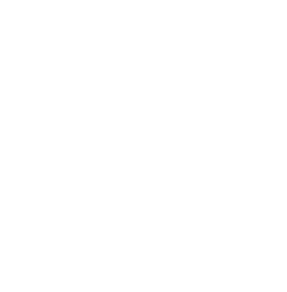

<p align="center">
  
</p>

Local-first experiment dashboard for deep learning. Log metrics, media, and
structured evaluation data from your training scripts, then compare runs
in a rich Streamlit UI — scalars, images, video, audio, text, with built-in
A/B comparison tools (toggle/flicker, pixel diff, word diff, synced zoom,
synced video playback).

---

## Install

```bash
pip install -e .
```

## Quick start

```python
import spikesnpipes as sp

w = sp.Writer("runs/my_experiment")

for step in range(100):
    w.add_scalar("Train/Loss", step=step, val=1.0 / (step + 1))
    w.add_scalar("Train/Accuracy", step=step, val=step / 100)

w.close()
```

```bash
spikesnpipes --logdir runs
```

That's it — open http://localhost:8501 and you'll see your plots.

To explore all section types with demo data:

```bash
python examples/demo_sections.py
spikesnpipes --logdir demo_sections
```

---

## What's inside

### Training logging

Log data from your training loop. The dashboard auto-discovers tags and
renders them.

| What | API | Formats |
|------|-----|---------|
| [Scalars](#scalars) | `add_scalar` | loss, lr, metrics — any float |
| [Images](#images) | `add_images` | numpy `uint8`/`float32`, PIL, file path |
| [Video](#video) | `add_video`, `add_videos` | numpy `uint8 (T,H,W,3)`, file path |
| [Audio](#audio) | `add_audio`, `add_audios` | numpy `float32`/`int16`, file path, bytes |
| [Text](#text) | `add_text` | plain text or markdown |

### Evaluation sections

Structured layouts for inspecting model outputs across runs. Shows all
selected runs side-by-side with a step slider.

| Section | Use case |
|---------|----------|
| [Text → Image eval](#eval-t2i) | Diffusion, text-to-image generation |
| [Text → Text eval](#eval-t2t) | Translation, LLM, summarisation |
| [Audio → Text eval](#eval-a2t) | ASR / speech recognition |
| [Text → Audio eval](#eval-t2a) | TTS / speech synthesis |
| [Text + Image → Image eval](#eval-ti2i) | Editing, inpainting, style transfer |
| [Text + Image → Text eval](#eval-ti2t) | VLM, visual QA |
| [Text → Video eval](#eval-t2v) | Video generation |
| [Text + Image → Video eval](#eval-ti2v) | Image animation |

### Comparison sections

Built for **model compression, acceleration, and distillation** engineers.
When you optimise a model (quantize, prune, distil), you need to verify
the compressed version still matches the original. Comparison sections give
you precise A/B tools to catch regressions that metrics alone might miss.

| Section | Tools |
|---------|-------|
| [Text → Image comparison](#cmp-t2i) | Toggle/flicker, pixel diff ×10, synced zoom & pan |
| [Text → Text comparison](#cmp-t2t) | Word-level diff (green = added, red = removed) |
| [Audio → Text comparison](#cmp-a2t) | Word-level diff |
| [Text → Audio comparison](#cmp-t2a) | A/B playback |
| [Text + Image → Image comparison](#cmp-ti2i) | Toggle/flicker, pixel diff ×10, synced zoom & pan |
| [Text + Image → Text comparison](#cmp-ti2t) | Word-level diff |
| [Text → Video comparison](#cmp-t2v) | Synced playback, frame stepping, speed control |
| [Text + Image → Video comparison](#cmp-ti2v) | Synced playback, frame stepping, speed control |

---

## Training logging

Add this to your training script:

```python
import spikesnpipes as sp

w = sp.Writer("runs/my_run")

for step in range(num_steps):
    w.add_scalar("Train/Loss", step=step, val=loss)

w.close()
```

### Scalars

```python
w.add_scalar("Train/Loss", step=100, val=0.42)
w.add_scalar("Train/LR", step=100, val=3e-4, x=0.42)  # custom x-axis
```

### Images

```python
w.add_images("Gen/Output", images=[output_img], step=step)
w.add_images("Gen/Batch", images=[img1, img2, img3], step=step)
```

Accepted inputs per image:

| Type | Range |
|------|-------|
| numpy `uint8` `(H,W,3)` | 0 – 255 |
| numpy `float32` `(H,W,3)` | 0.0 – 1.0, auto-scaled to 0–255 |
| `PIL.Image` | saved directly |
| `str` / `Path` | copied from disk |

### Video

```python
w.add_video("Gen/Video", video=frames, step=step)
w.add_videos("Gen/Videos", videos=[v1, v2], step=step)
```

| Type | Range |
|------|-------|
| numpy `uint8` `(T, H, W, 3)` | 0 – 255, saved as mp4 |
| `str` / `Path` | copied from disk |

### Audio

```python
w.add_audio("TTS/Output", audio=waveform, step=step, sr=16000)
w.add_audios("ASR/Batch", audios=[wav1, wav2], step=step, sr=16000)
```

| Type | Range |
|------|-------|
| numpy `float32` | -1.0 to 1.0, saved as WAV |
| numpy `int16` | raw PCM, saved as WAV |
| `str` / `Path` | copied from disk |
| `bytes` | written as-is |

### Text

```python
w.add_text("Train/Log", text="epoch 1 done", step=step)
w.add_text("LLM/Output", text="markdown **works** here", step=step)
```

---

## Evaluation sections

Eval sections show model outputs for all selected runs side-by-side.
Add the `add_*` calls to your training/eval loop, then register the
section once.

<a id="eval-t2i"></a>

### Text → Image eval

```python
w.add_text("Gen/Prompt", text=prompt, step=step)
w.add_images("Gen/Output", images=[generated_image], step=step)

w.create_text_to_image_section("Diffusion Eval",
    prompt_tag="Gen/Prompt", output_tag="Gen/Output")
```

<a id="eval-t2t"></a>

### Text → Text eval

```python
w.add_text("MT/Source", text=source, step=step)
w.add_text("MT/Output", text=model_output, step=step)
w.add_text("MT/Ref", text=reference, step=step)          # optional

w.create_text_to_text_section("Translation Eval",
    input_tag="MT/Source", output_tag="MT/Output",
    ground_truth_tag="MT/Ref")
```

<a id="eval-a2t"></a>

### Audio → Text eval

```python
w.add_audio("ASR/Audio", audio=waveform, step=step, sr=16000)
w.add_text("ASR/GT", text=transcript, step=step)
w.add_text("ASR/Pred", text=prediction, step=step)

w.create_audio_to_text_section("ASR Eval",
    audio_tag="ASR/Audio", prediction_tag="ASR/Pred",
    ground_truth_tag="ASR/GT")
```

<a id="eval-t2a"></a>

### Text → Audio eval

```python
w.add_text("TTS/Text", text=input_text, step=step)
w.add_audio("TTS/Audio", audio=synthesised_wav, step=step, sr=22050)

w.create_text_to_audio_section("TTS Eval",
    input_tag="TTS/Text", output_tag="TTS/Audio")
```

<a id="eval-ti2i"></a>

### Text + Image → Image eval

```python
w.add_text("Edit/Prompt", text=instruction, step=step)
w.add_images("Edit/Input", images=[source_image], step=step)
w.add_images("Edit/Output", images=[edited_image], step=step)

w.create_text_image_to_image_section("Edit Eval",
    prompt_tag="Edit/Prompt", input_image_tag="Edit/Input",
    output_tag="Edit/Output")
```

<a id="eval-ti2t"></a>

### Text + Image → Text eval

```python
w.add_text("VLM/Question", text=question, step=step)
w.add_images("VLM/Image", images=[input_image], step=step)
w.add_text("VLM/Answer", text=model_answer, step=step)

w.create_text_image_to_text_section("VLM Eval",
    prompt_tag="VLM/Question", input_image_tag="VLM/Image",
    output_tag="VLM/Answer")
```

<a id="eval-t2v"></a>

### Text → Video eval

```python
w.add_text("VGen/Prompt", text=prompt, step=step)
w.add_video("VGen/Output", video=generated_frames, step=step)

w.create_text_to_video_section("Video Gen",
    prompt_tag="VGen/Prompt", output_tag="VGen/Output")
```

<a id="eval-ti2v"></a>

### Text + Image → Video eval

```python
w.add_text("Anim/Prompt", text=prompt, step=step)
w.add_images("Anim/Input", images=[still_image], step=step)
w.add_video("Anim/Output", video=animated_frames, step=step)

w.create_text_image_to_video_section("Animate Eval",
    prompt_tag="Anim/Prompt", input_image_tag="Anim/Input",
    output_tag="Anim/Output")
```

---

## Comparison sections

Built for **model compression, acceleration, and distillation** engineers.
You have an original model and a compressed variant — you need to verify
the outputs still match. Comparison sections give you pixel-level A/B
tools to catch regressions that metrics alone miss.

### How it works

Write **one script**. Run it **twice** — once per model. The dashboard
compares the two runs automatically.

Each example below is a **complete script**. Copy it, run it twice with
different `--model` and `--run_name` args, then open the dashboard:

```bash
python eval_diffusion.py --model models/sd_fp16   --run_name original
python eval_diffusion.py --model models/sd_int8   --run_name compressed
spikesnpipes --logdir runs
```

```
runs/
├── original/    ← outputs from sd_fp16
│   └── spikes.db
└── compressed/  ← outputs from sd_int8
    └── spikes.db
```

The dashboard discovers both runs. Pick Run A and Run B in the
comparison section and use the built-in tools to spot differences.

---

<a id="cmp-t2i"></a>

### Text → Image comparison

Compare generated images from two models given the same prompt.
Run the script below twice — once for the original model, once for the
compressed one. Both runs log to separate directories under `runs/`.
Open the dashboard with `spikesnpipes --logdir runs` and pick Run A / Run B
to compare outputs side-by-side.
Tools: toggle/flicker, pixel diff ×10, synced zoom (100%–400%) & pan.

```python
# eval_diffusion.py — run twice with different --model / --run_name
import argparse
import spikesnpipes as sp
from my_model import load_model

args = argparse.ArgumentParser()
args.add_argument("--model", required=True)
args.add_argument("--run_name", required=True)
args = args.parse_args()

model = load_model(args.model)
w = sp.Writer(f"runs/{args.run_name}")

# 1. Declare the comparison section (what tags to compare)
w.create_text_to_image_comparison("Diffusion Compare",
    prompt_tag="Gen/Prompt", output_tag="Gen/Output")

# 2. Run eval and log data
for step, prompt in enumerate(["a red car at sunset", "a cat on a windowsill"]):
    image = model.generate(prompt)
    w.add_text("Gen/Prompt", text=prompt, step=step)
    w.add_images("Gen/Output", images=[image], step=step)

w.close()
```

<a id="cmp-t2t"></a>

### Text → Text comparison

Compare text outputs (translation, LLM, summarisation) from two models.
Run the script twice with different `--model` / `--run_name` to produce
two runs, then open the dashboard to see word-level diffs between them.
Tools: word-level diff — green = added, red = removed.

```python
# eval_translate.py — run twice with different --model / --run_name
import argparse
import spikesnpipes as sp
from my_model import load_model

args = argparse.ArgumentParser()
args.add_argument("--model", required=True)
args.add_argument("--run_name", required=True)
args = args.parse_args()

model = load_model(args.model)
w = sp.Writer(f"runs/{args.run_name}")

w.create_text_to_text_comparison("Translation Compare",
    input_tag="MT/Source", output_tag="MT/Output",
    ground_truth_tag="MT/Ref")

for step, (source, reference) in enumerate(test_pairs):
    output = model.translate(source)
    w.add_text("MT/Source", text=source, step=step)
    w.add_text("MT/Output", text=output, step=step)
    w.add_text("MT/Ref", text=reference, step=step)

w.close()
```

<a id="cmp-a2t"></a>

### Audio → Text comparison

Compare ASR transcriptions from two models on the same audio clips.
Run the script twice — each run transcribes the same audio with a
different model. The dashboard highlights word-level differences
between the two transcriptions.
Tools: word-level diff.

```python
# eval_asr.py — run twice with different --model / --run_name
import argparse
import spikesnpipes as sp
from my_model import load_model

args = argparse.ArgumentParser()
args.add_argument("--model", required=True)
args.add_argument("--run_name", required=True)
args = args.parse_args()

model = load_model(args.model)
w = sp.Writer(f"runs/{args.run_name}")

w.create_audio_to_text_comparison("ASR Compare",
    audio_tag="ASR/Audio", prediction_tag="ASR/Pred",
    ground_truth_tag="ASR/GT")

for step, (audio, transcript) in enumerate(test_samples):
    prediction = model.transcribe(audio)
    w.add_audio("ASR/Audio", audio=audio, step=step, sr=16000)
    w.add_text("ASR/Pred", text=prediction, step=step)
    w.add_text("ASR/GT", text=transcript, step=step)

w.close()
```

<a id="cmp-t2a"></a>

### Text → Audio comparison

Compare synthesised speech from two TTS models on the same input text.
Run the script twice to produce two sets of audio files, then listen to
both side-by-side in the dashboard to catch quality regressions.
Tools: A/B playback.

```python
# eval_tts.py — run twice with different --model / --run_name
import argparse
import spikesnpipes as sp
from my_model import load_model

args = argparse.ArgumentParser()
args.add_argument("--model", required=True)
args.add_argument("--run_name", required=True)
args = args.parse_args()

model = load_model(args.model)
w = sp.Writer(f"runs/{args.run_name}")

w.create_text_to_audio_comparison("TTS Compare",
    input_tag="TTS/Text", output_tag="TTS/Audio")

for step, text in enumerate(test_sentences):
    wav = model.synthesise(text)
    w.add_text("TTS/Text", text=text, step=step)
    w.add_audio("TTS/Audio", audio=wav, step=step, sr=22050)

w.close()
```

<a id="cmp-ti2i"></a>

### Text + Image → Image comparison

Compare image editing / inpainting outputs from two models. Both runs
receive the same source image and instruction — each produces an edited
output. Run the script twice, then toggle between the two outputs in the
dashboard to spot pixel-level artefacts.
Tools: toggle/flicker, pixel diff ×10, synced zoom & pan.

```python
# eval_edit.py — run twice with different --model / --run_name
import argparse
import spikesnpipes as sp
from my_model import load_model

args = argparse.ArgumentParser()
args.add_argument("--model", required=True)
args.add_argument("--run_name", required=True)
args = args.parse_args()

model = load_model(args.model)
w = sp.Writer(f"runs/{args.run_name}")

w.create_text_image_to_image_comparison("Edit Compare",
    prompt_tag="Edit/Prompt", input_image_tag="Edit/Input",
    output_tag="Edit/Output")

for step, (instruction, source_image) in enumerate(test_edits):
    edited = model.edit(source_image, instruction)
    w.add_text("Edit/Prompt", text=instruction, step=step)
    w.add_images("Edit/Input", images=[source_image], step=step)
    w.add_images("Edit/Output", images=[edited], step=step)

w.close()
```

<a id="cmp-ti2t"></a>

### Text + Image → Text comparison

Compare VLM / visual QA answers from two models. Both runs see the same
image and question — the dashboard shows the two answers side-by-side
with word-level diff highlighting so you can spot semantic regressions.
Tools: word-level diff.

```python
# eval_vlm.py — run twice with different --model / --run_name
import argparse
import spikesnpipes as sp
from my_model import load_model

args = argparse.ArgumentParser()
args.add_argument("--model", required=True)
args.add_argument("--run_name", required=True)
args = args.parse_args()

model = load_model(args.model)
w = sp.Writer(f"runs/{args.run_name}")

w.create_text_image_to_text_comparison("VLM Compare",
    prompt_tag="VLM/Question", input_image_tag="VLM/Image",
    output_tag="VLM/Answer")

for step, (image, question) in enumerate(test_questions):
    answer = model.ask(image, question)
    w.add_text("VLM/Question", text=question, step=step)
    w.add_images("VLM/Image", images=[image], step=step)
    w.add_text("VLM/Answer", text=answer, step=step)

w.close()
```

<a id="cmp-t2v"></a>

### Text → Video comparison

Compare generated videos from two models given the same prompt. Run the
script twice to produce two sets of clips, then play them simultaneously
in the dashboard with a single play button to catch temporal differences.
Tools: synced playback, frame-by-frame stepping, speed control (0.25×–2×).

```python
# eval_videogen.py — run twice with different --model / --run_name
import argparse
import spikesnpipes as sp
from my_model import load_model

args = argparse.ArgumentParser()
args.add_argument("--model", required=True)
args.add_argument("--run_name", required=True)
args = args.parse_args()

model = load_model(args.model)
w = sp.Writer(f"runs/{args.run_name}")

w.create_text_to_video_comparison("Video Compare",
    prompt_tag="VGen/Prompt", output_tag="VGen/Output")

for step, prompt in enumerate(test_prompts):
    frames = model.generate_video(prompt)
    w.add_text("VGen/Prompt", text=prompt, step=step)
    w.add_video("VGen/Output", video=frames, step=step)

w.close()
```

<a id="cmp-ti2v"></a>

### Text + Image → Video comparison

Compare animated clips from two models given the same source image and
prompt. Run the script twice — each produces an animation from the same
still frame. The dashboard syncs both videos so you can step through
frame-by-frame and verify temporal consistency.
Tools: synced playback, frame stepping, speed control.

```python
# eval_animate.py — run twice with different --model / --run_name
import argparse
import spikesnpipes as sp
from my_model import load_model

args = argparse.ArgumentParser()
args.add_argument("--model", required=True)
args.add_argument("--run_name", required=True)
args = args.parse_args()

model = load_model(args.model)
w = sp.Writer(f"runs/{args.run_name}")

w.create_text_image_to_video_comparison("Animate Compare",
    prompt_tag="Anim/Prompt", input_image_tag="Anim/Input",
    output_tag="Anim/Output")

for step, (image, prompt) in enumerate(test_animations):
    frames = model.animate(image, prompt)
    w.add_text("Anim/Prompt", text=prompt, step=step)
    w.add_images("Anim/Input", images=[image], step=step)
    w.add_video("Anim/Output", video=frames, step=step)

w.close()
```

---

### Section descriptions

Every `create_*` method accepts an optional `description` (markdown):

```python
w.create_text_to_image_comparison("Diffusion Compare",
    prompt_tag="Gen/Prompt", output_tag="Gen/Output",
    description="Comparing SD v1.5 vs quantized INT8 variant.")
```

---

## CLI reference

```
spikesnpipes --logdir <path>          # required
             --host 0.0.0.0           # default: localhost
             --port 8501              # default: 8501
```

---

## Full demo

```bash
python examples/demo_sections.py
spikesnpipes --logdir demo_sections
```

Creates two runs (`original` and `compressed`) with scalars, images,
video, text, audio, and every section type listed above.
